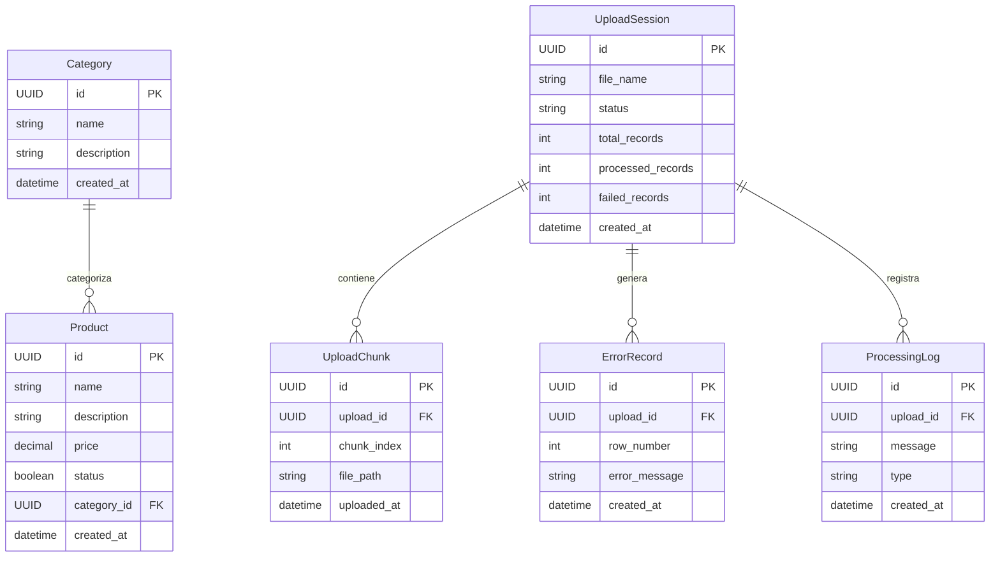
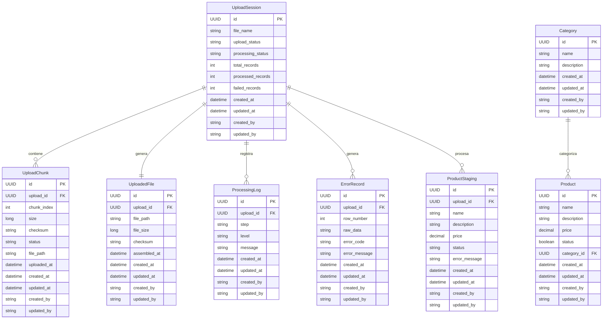

## 📅 Día 1 - 25/Mar/2026

### 🔹 Feature en análisis
Product Catalog Management
---

### 🤖 Propuesta de la IA
La IA sugirió construir un documento de diseño basado en las siguientes secciones:

1. **La feature**: qué hace, para qué sirve, qué problema resuelve.
2. **Requerimientos** *(obligatorio)*: usando Historias de Usuario (`"Como usuario quiero X para lograr Y"`) o Requerimientos Funcionales.
3. **Diseño de la solución**: arquitectura, componentes involucrados y flujo de datos.
4. **Diagramas** *(obligatorio)*: al menos diagrama de arquitectura + diagrama de secuencia o de clases.
5. **Pensamiento técnico** *(clave)*: decisiones de diseño, justificación de la solución elegida y consideraciones de escala/validaciones.

---

### 📚 Investigación humana (Documentación oficial)
- Fuente 1: [IEEE 830 - Video explicativo](https://www.youtube.com/watch?v=AotyBHVKp8I)
- Fuente 2: [IEEE 830 - PDF oficial UCM](https://www.fdi.ucm.es/profesor/gmendez/docs/is0809/ieee830.pdf)

**Hallazgos:**
- IEEE 830 define un estándar formal llamado **Software Requirements Specification (SRS)** con una estructura clara y estandarizada.
- Evita secciones sueltas o documentos inconsistentes al imponer una organización específica: introducción, descripción general, requerimientos específicos (funcionales, no funcionales, restricciones), etc.
- A diferencia de la propuesta libre de la IA, IEEE 830 provee un marco reconocido por la industria que facilita la trazabilidad, revisión y mantenimiento de los requerimientos.

---

### ⚖️ Análisis crítico
| Criterio | Propuesta IA | IEEE 830 |
|---|---|---|
| Estructura | Flexible, orientada a puntos de evaluación | Estandarizada, con secciones predefinidas |
| Trazabilidad | Depende del autor | Garantizada por el estándar |
| Cobertura de reqs. no funcionales | No explícita | Sección dedicada |
| Reconocimiento industria | No | Sí (estándar internacional) |
| Facilidad de inicio | Alta | Media (requiere conocer el estándar) |

**Problemas encontrados en la propuesta de la IA:** no establece cómo organizar requerimientos no funcionales ni restricciones del sistema; la estructura libre puede derivar en documentos difíciles de mantener o auditar.

---

### ✅ Decisión tomada
- Seguir el estándar **IEEE 830 (SRS)** para documentar la feature *Product Catalog Management*.
- **Justificación técnica:** provee una estructura clara, completa y reconocida; obliga a cubrir requerimientos funcionales, no funcionales y restricciones de forma explícita.
- **Justificación de negocio:** facilita la revisión por parte de otros stakeholders y garantiza trazabilidad de los requerimientos a lo largo del ciclo de vida del proyecto.

---

### 🧩 Impacto en el diseño
- El documento SRS se convierte en la fuente de verdad de la feature antes de entrar a diseño técnico.
- Las historias de usuario se derivan/mapean desde los requerimientos funcionales del SRS, no al revés.
- Las decisiones de arquitectura deberán justificarse contra las restricciones y reqs. no funcionales definidos en el SRS.

---

## 📅 Día 2 - 26/Mar/2026

### 🔹 Feature en análisis
CSV Upload para archivos grandes (5GB+)

---

### 🤖 Propuesta de la IA
Implementar un endpoint único POST `/upload` que:
1. Recibe el archivo CSV completo
2. Valida tamaño (hasta 5GB)
3. Lo almacena temporalmente sin procesamiento en memoria
4. Delega el procesamiento a un servicio asincrónico
5. Lee el archivo mediante streaming
6. Lo divide en lotes
7. Valida cada registro
8. Inserta en BD solo datos válidos
9. Registra errores sin detener el proceso completo

---

### 👤 Propuesta del usuario (mejorada)
Implementar **carga por partes (chunked upload)** en lugar de un endpoint monolítico:

1. **Cliente divide el archivo en fragmentos** (10–100 MB cada uno)
2. **API crea una sesión de carga** (generando un session ID)
3. **Endpoints específicos por chunk**:
   - POST `/upload/session` → inicia sesión
   - POST `/upload/session/{id}/chunk` → recibe cada fragmento
   - POST `/upload/session/{id}/complete` → marca como finalizado
4. **Almacenamiento en disco directo** sin uso extensivo de memoria
5. **Ensamblaje del archivo final** una vez todos los chunks se recibieron
6. **Marcado de estado UPLOADED**
7. **Dispara proceso asincrónico** que lee el CSV en streaming
8. **Carga masiva a BD** usando herramientas nativas (external tables, bulk insert)

**Ventajas:**
- Tolerancia a fallos de red (reintentar solo el chunk fallido)
- Sin problemas de timeout en trasferencias largas
- Escalable a archivos de cualquier tamaño
- Bajo uso de memoria en servidor
- Permite resume/retry de uploads interrumpidos

---

### 📚 Investigación humana (Estándares y librerías)
- Fuente 1: [tus.io - Resumable Upload Protocol](https://tus.io/protocols/resumable-upload?utm_source=chatgpt.com)
- Fuente 2: [tus-java-client - GitHub](https://github.com/tus/tus-java-client)

**Hallazgos:**
- **tus.io** es un protocolo estándar de la industria para uploads **reanudables** (resumable uploads).
- Define operaciones HTTP como PATCH para enviar chunks y permite pausar/reanudar sin reiniciar la transferencia completa.
- **tus-java-client** es una librería Java lista para usar que implementa el protocolo tus, facilitando integración sin reinventar la rueda.
- Usado por plataformas de escala (Vimeo, Netflix, Cloudinary) para manejar uploads de video y datos masivos.
- Compatible con Spring Boot mediante adaptadores ligeros.

---

### ⚖️ Análisis crítico
| Criterio | Propuesta IA (endpoint único) | Propuesta usuario (chunked + tus) |
|---|---|---|
| **Simplicidad inicial** | Alta (un endpoint) | Media (requiere sesión + chunks) |
| **Tolerancia a fallos de red** | Baja (reintentar todo) | Alta (reintentar solo chunk fallido) |
| **Uso de memoria** | Alto (buffer todo en RAM) | Bajo (stream directo a disco) |
| **Escalabilidad a 5GB+** | Media (riesgo OOM, timeouts) | Alta (sin límites prácticos) |
| **Experiencia UX cliente** | Pobre (sin progreso parcial) | Excelente (progreso granular + resume) |
| **Complejidad de implementación** | Media | Media-Alta (pero usando tus-java-client baja) |
| **Reconocimiento industria** | No | Sí (protocolo tus estándar) |
| **Reutilización** | Baja (específico del proyecto) | Alta (patrón aplicable a otros uploads) |

**Problemas de la propuesta IA:**
- No maneja networkTimeouts para transferencias de 5GB.
- Requiere buffering en RAM, lo que escala mal con concurrencia.
- No permite resume: un fallo obliga a recargar todo.
- Asume conectividad perfecta en producción.

---

### ✅ Decisión recomendada
- Adoptar la **propuesta del usuario con protocolo tus.io**.
- **Justificación técnica:** 
  - Protocolo estándar, documentado y probado en escala industrial.
  - `tus-java-client` elimina trabajo de implementación.
  - Chunking + streaming = sin riesgo de OOM ni timeouts.
  - Resume/retry automático mejora confiabilidad.
- **Justificación de negocio:**
  - Mejor experiencia usuario en clientes (progreso visible, resumible).
  - Reduce fallos operativos y carga de soporte.
  - Deuda técnica baja (patrón reutilizable en futuras features de upload).

---

### 🧩 Impacto en el diseño
- El endpoint de upload se divide en **3 operaciones HTTP** (sesión, chunks, completitud).
- El servicio asincrónico actual se reutiliza tras recibir el archivo completo.
- Se introduce **sesión de upload** en modelo de datos (tabla `upload_session`).
- Integración con `OutboxEvent` para notificar progreso/errores a otros sistemas.
- Cliente (frontend/integración) debe implementar `tus` protocol o usar `tus-js-client` (existe para JS/TS).

---

## 📅 Día 2 - 26/Mar/2026

### 🔹 Feature en análisis
Investigación frontend para chunking de archivos grandes (File API + Blob.slice)

---

### 🤖 Propuesta de la IA
No aplica.

---

### 📚 Investigación humana (Documentación oficial)
- Fuente 1: [MDN - Blob.slice()](https://developer.mozilla.org/en-US/docs/Web/API/Blob/slice)
- Fuente 2: [MDN - File API](https://developer.mozilla.org/en-US/docs/Web/API/File)

**Hallazgos:**
- La **File API** representa archivos seleccionados por el usuario como objetos manipulables en JavaScript (basados en `Blob`) sin cargarlos completos en memoria.
- `Blob.slice()` permite dividir un archivo en fragmentos por rangos de bytes (chunks), habilitando cargas progresivas y reanudables.
- Este enfoque reduce consumo de memoria en frontend y mejora la robustez frente a fallos de red.
- Permite enviar solo partes del archivo al servidor en vez de transferirlo completo en una sola petición.

---

### ⚖️ Análisis crítico
| Criterio | Propuesta IA | Investigación propia (MDN File API + Blob.slice) |
|---|---|---|
| Aplicabilidad al caso | No aplica | Alta |
| Base técnica verificable | No aplica | Alta (documentación oficial MDN) |
| Soporte para chunking | No aplica | Sí |
| Soporte para reanudación | No aplica | Sí (como base para resumable uploads) |
| Riesgo de memoria en cliente | No aplica | Bajo |

---

### ✅ Decisión tomada
- Adoptar en frontend el uso de **File API** y **Blob.slice()** como base para envío por chunks.
- **Justificación técnica:** APIs nativas del navegador, documentación oficial y compatibilidad con estrategia de upload reanudable.
- **Justificación de negocio:** mejora experiencia de carga de archivos grandes, reduce fallos y retrabajo de usuarios.

---

### 🧩 Impacto en el diseño
- El cliente debe implementar lectura por fragmentos y envío incremental al backend.
- Se alinea con la arquitectura de carga por sesiones/chunks definida en el Día 2.
- Habilita mostrar progreso real de subida y reintentos por fragmento sin reiniciar todo el archivo.

---

## 📅 Día 2 - 26/Mar/2026

### 🔹 Feature en análisis
Optimización de inserciones por batch en JPA/Hibernate para cargas masivas de CSV

---

### 🤖 Propuesta de la IA
No aplica.

---

### 📚 Investigación humana (Documentación oficial)
- Fuente 1: [Hibernate ORM - Batch Processing](https://docs.hibernate.org/orm/current/userguide/html_single/#caching)

**Hallazgos:**
- Hibernate permite agrupar múltiples operaciones INSERT en una sola petición SQL mediante configuración de `hibernate.jdbc.batch_size` (ej: 50 registros).
- El patrón recomendado es usar `EntityManager.persist()` dentro de un ciclo, seguido de `flush()` y `clear()` cada N registros para evitar acumulación excesiva de objetos en memoria.
- **GenerationType.IDENTITY debe evitarse** en operaciones batch porque rompe el batching; preferir **SEQUENCE** o **TABLE**.
- Para volúmenes muy grandes (millones de filas), considerar JDBC batch nativo o herramientas nativas de BD (LOAD DATA INFILE en MySQL, COPY en PostgreSQL) para máximo rendimiento.
- El batching reduce drasticamente la cantidad de round-trips a BD y mejora el throughput de inserciones.

---

### ⚖️ Análisis crítico
| Criterio | Alternativa JPA batch | JDBC batch | Herramientas nativas BD |
|---|---|---|---|
| **Facilidad de implementación** | Alta (configuración + ciclo) | Media | Media (SQL específico) |
| **Rendimiento** | Alto (bueno para 100K-1M) | Muy Alto | Máximo (para millones) |
| **Control de errores** | Granular (por registro) | Granular | Limitado (falsos o todos) |
| **Compatibilidad multiplataforma** | Total (JPA estándar) | Total (JDBC) | Específica por BD |
| **Facilidad de monitoreo** | Media | Media | Baja |
| **Gestión de memoria** | Requiere flush/clear manual | Requiere ciclos | Baja (stream directo) |

**Recomendación por escala:**
- **Hasta 100K registros:** JPA batch con EntityManager + flush/clear cada 50.
- **100K - 1M registros:** JPA batch o JDBC batch (evaluar ganancia vs complejidad).
- **Más de 1M registros:** Considerar herramientas nativas de BD para máximo rendimiento.

---

### ✅ Decisión recomendada
- Para operaciones de carga masiva de CSV dentro del rango **100K - 1M de registros**, usar **JPA batch con Hibernate** (`hibernate.jdbc.batch_size`).
- Para archivos que excedan **1M registros**, evaluar transición a **JDBC batch nativo** o **herramientas de BD nativas**.
- **Justificación técnica:**
  - Mantiene consistencia con ORM actual (JPA/Hibernate).
  - Ofrece buen balance entre rendimiento y mantenibilidad.
  - Permite feedback granular de errores de validación por registro.
  - La configuración es sencilla y reutilizable.
- **Justificación de negocio:**
  - Reduce tiempos de carga significativamente.
  - Permite escalar a millones de registros sin rediseño completo.
  - Facilita mantenimiento y debugging vs soluciones ad-hoc.

---

### 🧩 Impacto en el diseño
- El servicio asincrónico de procesamiento CSV debe implementar el patrón de flush/clear cada N registros.
- Configuración Hibernate en `application.yaml`: `hibernate.jdbc.batch_size: 50`.
- Debe evitarse `GenerationType.IDENTITY` en la entidad de productos/registros; usar `SEQUENCE`.
- Se recomienda agregar métricas de progreso (registros procesados, errores, velocidad) para monitoreo.
- Si el volumen supera 1M, se debe revisar y posiblemente reescribir usando JDBC batch o herramientas nativas.

---

## 📅 Día 2 - 26/Mar/2026

### 🔹 Feature en análisis
Diagrama Entidad-Relación: evolución del modelo de datos (v1 → v2)

---

### 🤖 Propuesta de la IA

---

### 👤 Propuesta del usuario (mejorada)

**Mejoras introducidas:**
- `UploadChunk` agrega `size`, `checksum` y `status` por fragmento, habilitando integridad y reanudación.
- `UploadedFile` es una entidad nueva que representa el archivo final ensamblado, separando el concepto de "archivo subido" del de "sesión de subida".
- `ProductStaging` es una entidad nueva que actúa como tabla de staging ETL; los datos se validan aquí antes de consolidarse en `Product`.
- `ProcessingLog` agrega `step` y `level` para trazabilidad granular por fase del proceso.
- `ErrorRecord` agrega `raw_data` y `error_code`, permitiendo análisis de errores por fila sin perder el dato original.
- `UploadSession` separa `upload_status` y `processing_status` en dos campos independientes.
- Todas las entidades tienen auditoría completa: `updated_at`, `created_by`, `updated_by`.

---

### 📚 Investigación humana (Documentación oficial)
No aplica — diseño propio basado en análisis comparativo y buenas prácticas de modelado ETL.

---

### ⚖️ Análisis crítico
| Criterio | Modelo v1 (IA) | Modelo v2 (mejorado) |
|---|---|---|
| **Entidades** | 6 | 8 (+UploadedFile, +ProductStaging) |
| **Separación upload/procesamiento** | No (un solo `status`) | Sí (`upload_status` + `processing_status`) |
| **Integridad por chunk** | No (sin checksum ni estado) | Sí (checksum + status por chunk) |
| **Staging antes de persistir** | No (directo a Product) | Sí (ProductStaging como buffer ETL) |
| **Trazabilidad de log** | Básica (message + type) | Granular (step + level + message) |
| **Trazabilidad de errores** | Básica (message + row) | Completa (raw_data + error_code + message) |
| **Auditoría** | Solo `created_at` | Completa (created/updated at + by) |
| **Tolerancia a fallos** | Baja | Alta (resume por chunk + staging) |

**Problemas del modelo v1:**
- Sin `UploadedFile`, no hay punto de ensamblado explícito; el sistema no sabe cuándo el archivo está completo.
- Sin `ProductStaging`, un fallo de validación en producción puede dejar datos corruptos en `Product`.
- Sin `checksum` por chunk, no es posible verificar integridad al reanudar una carga.
- Un solo campo `status` no diferencia entre "archivo subido" y "datos procesados".

---

### ✅ Decisión tomada
- Adoptar el **modelo v2** como esquema canónico para implementación.
- **Justificación técnica:**
  - Flujo ETL explícito: `UploadChunk` → `UploadedFile` → `ProductStaging` → `Product`.
  - Cada responsabilidad tiene su propia entidad; cambios futuros no afectan al resto.
  - `checksum` por chunk garantiza integridad ante reinicios o fallos de red.
  - Auditoría completa requerida para trazabilidad en entornos productivos.
- **Justificación de negocio:**
  - Reduce riesgo de catálogo de productos corrupto tras una carga fallida.
  - Permite soportar auditorías y revisiones regulatorias con trazabilidad de quién cargó qué.
  - El patrón de staging es reutilizable para futuras cargas masivas de otros dominios.

---

### 🧩 Impacto en el diseño
- El modelo v2 requiere 8 tablas en total: `category`, `product`, `upload_session`, `upload_chunk`, `uploaded_file`, `product_staging`, `processing_log`, `error_record`.
- Las migraciones deben respetar el orden de FKs: `upload_session` primero, luego sus dependientes.
- El servicio ETL sigue el flujo: lectura desde `uploaded_file` → escritura en `product_staging` → validación → inserción en `product`.
- `ProcessingLog` se escribe en cada transición de estado del flujo.
- `ErrorRecord` acumula errores sin detener el proceso; se reporta al finalizar la sesión.

---

