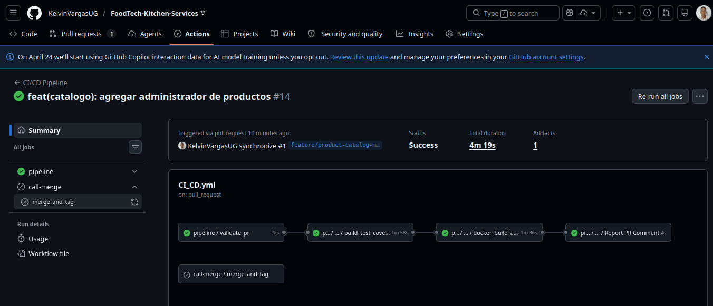
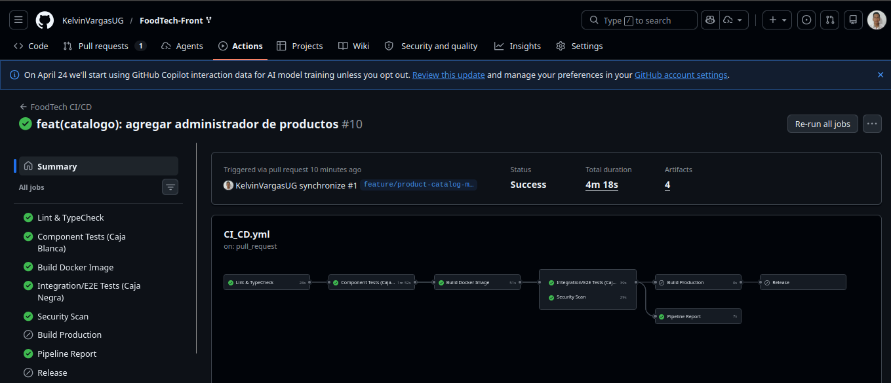

## Pipeline Backend - FoodTech Kitchen Services

### Reporte de Pipeline

**Estado General: EXITOSO**

**Job: Validacion de PR**

Estado: success

Evaluaciones realizadas:

- Version en Gradle: 0.0.1-RELEASE
- Tag esperado: 0.0.1-RELEASE
- Cantidad de commits: 1
- Validacion de version: Coincide con el tag esperado
- Validacion de commits: Exactamente 1 commit en el PR

**Job: Build & Test**

Estado: success

Evaluaciones realizadas:

- Compilacion de codigo con Gradle
- Ejecucion de pruebas unitarias
- Cobertura de codigo (JaCoCo - minimo 90%)
- Generacion de reportes de pruebas
- Creacion de artefactos (JAR, reportes)

**Job: Escaneo de Docker**

Estado: success

Evaluaciones realizadas:

- Construccion de imagen Docker
- Escaneo de vulnerabilidades con Trivy
- Analisis de severidad (CRITICAL, HIGH, MEDIUM, LOW)
- Carga de resultados a Code Scanning
- Validacion de vulnerabilidades criticas

---

## Pipeline Frontend - FoodTech Front

### Reporte de Pipeline

**Estado General: EXITOSO**

**Job: Lint & TypeCheck**

Estado: success

Evaluaciones realizadas:

- Verificacion de estilo y reglas con ESLint
- Validacion de tipos estaticos con TypeScript (tsc --noEmit)
- Bloquea la integracion si hay errores de lint o tipado

**Job: Component Tests (Caja Blanca)**

Estado: success

Evaluaciones realizadas:

- Ejecucion de tests unitarios con Vitest en modo CI
- Cobertura de codigo con umbral minimo del 90% (lines, statements, functions, branches)
- Publicacion de resultados de tests como artefacto (test-results/)
- Publicacion del reporte de cobertura como artefacto (coverage/)

**Job: Build Docker Image**

Estado: success

Evaluaciones realizadas:

- Construccion unica de la imagen Docker (multi-stage build)
- Exportacion de la imagen como tarball comprimido (image.tar.gz)
- Publicacion del tarball como artefacto compartido para los jobs siguientes
- Evita reconstrucciones duplicadas en los jobs paralelos

**Job: Integration/E2E Tests (Caja Negra) y Security Scan** *(en paralelo)*

Estado: success

Integration/E2E Tests:

- Descarga y carga de la imagen Docker previamente construida
- Ejecucion de tests E2E con Cypress dentro del contenedor
- Publicacion de capturas de pantalla como artefacto (cypress/screenshots/)

Security Scan:

- Descarga y carga de la imagen Docker previamente construida
- Escaneo de vulnerabilidades con Trivy
- Generacion de reporte en formato SARIF
- Publicacion de resultados como artefacto (trivy-results.sarif)

**Job: Build Production** *(solo en main y release/\*)*

Estado: success

Evaluaciones realizadas:

- Compilacion del bundle de produccion con Vite (npm run build)
- Publicacion del artefacto de build (dist/) con retencion de 7 dias
- Se ejecuta solo si integration-tests y security-scan pasaron

**Job: Release** *(solo en main)*

Estado: success

Evaluaciones realizadas:

- Creacion de tag de version automatico: v1.0.{run_number}
- Push del tag al repositorio
- Creacion de GitHub Release en estado draft con el artefacto de build

**Job: Pipeline Report** *(solo en Pull Requests)*

Estado: success

Evaluaciones realizadas:

- Descarga del reporte de cobertura generado en component-tests
- Publicacion de comentario automatico en el PR con el resumen de todos los jobs
- Incluye tabla de cobertura (lines, statements, functions, branches) vs umbral 90%
- Indica estado global del pipeline (PASO / FALLO)
