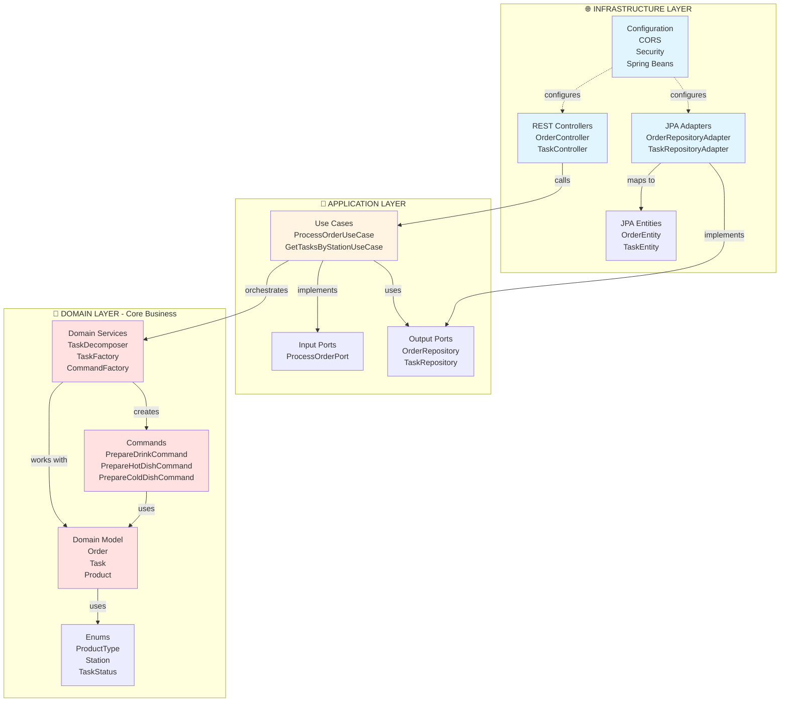
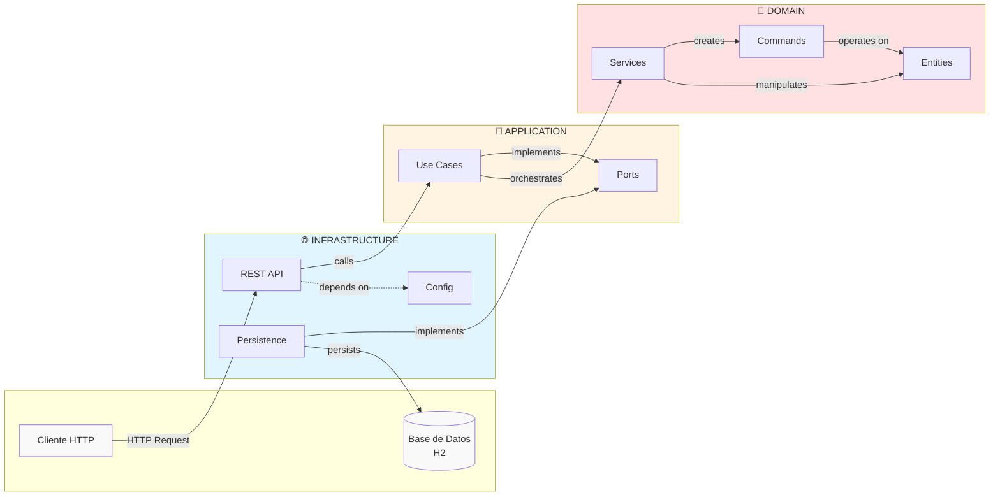
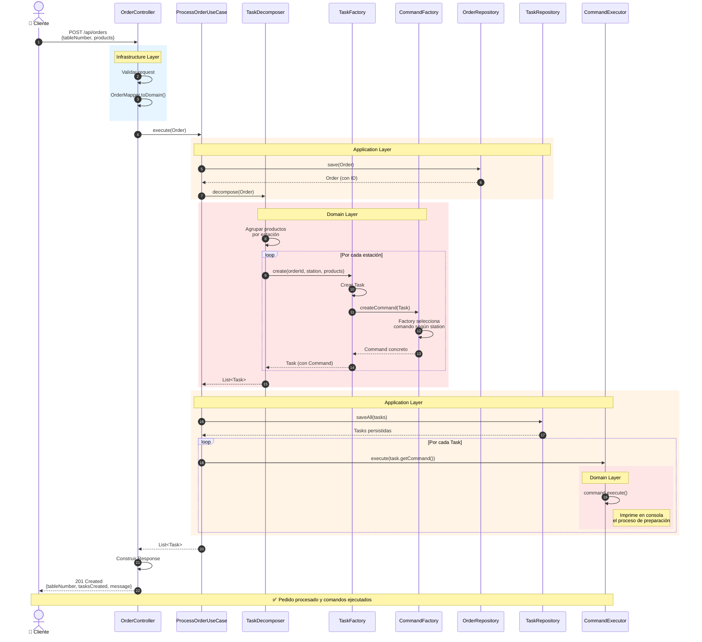
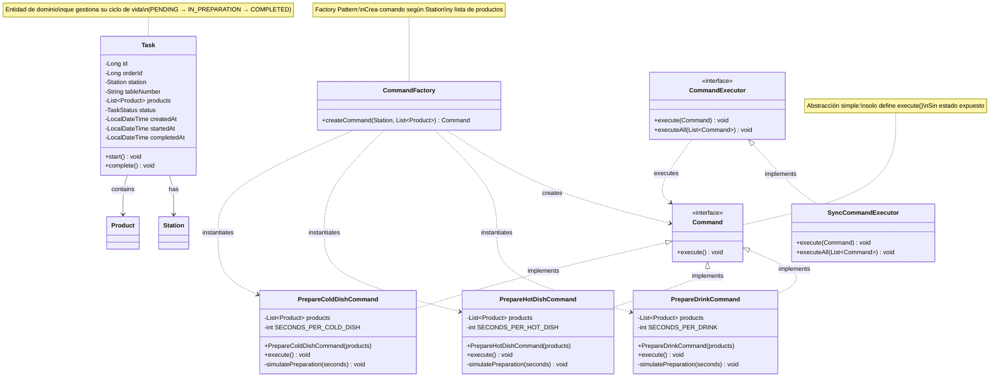
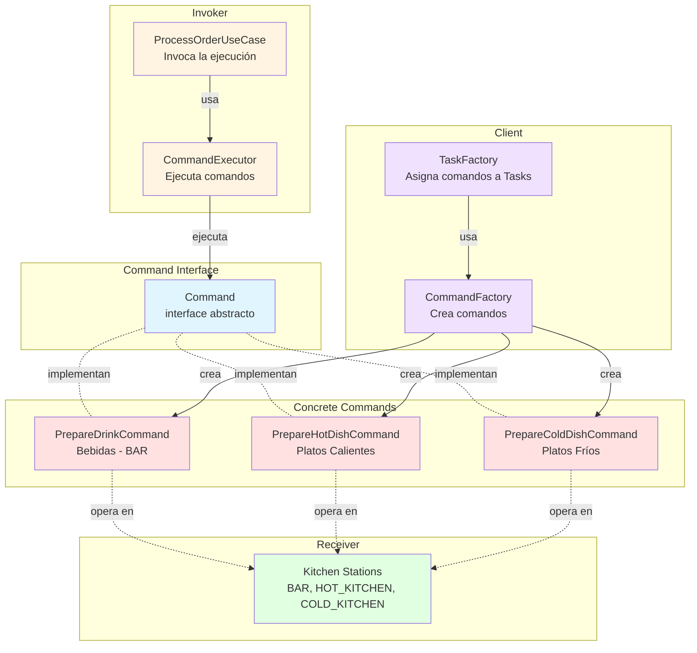
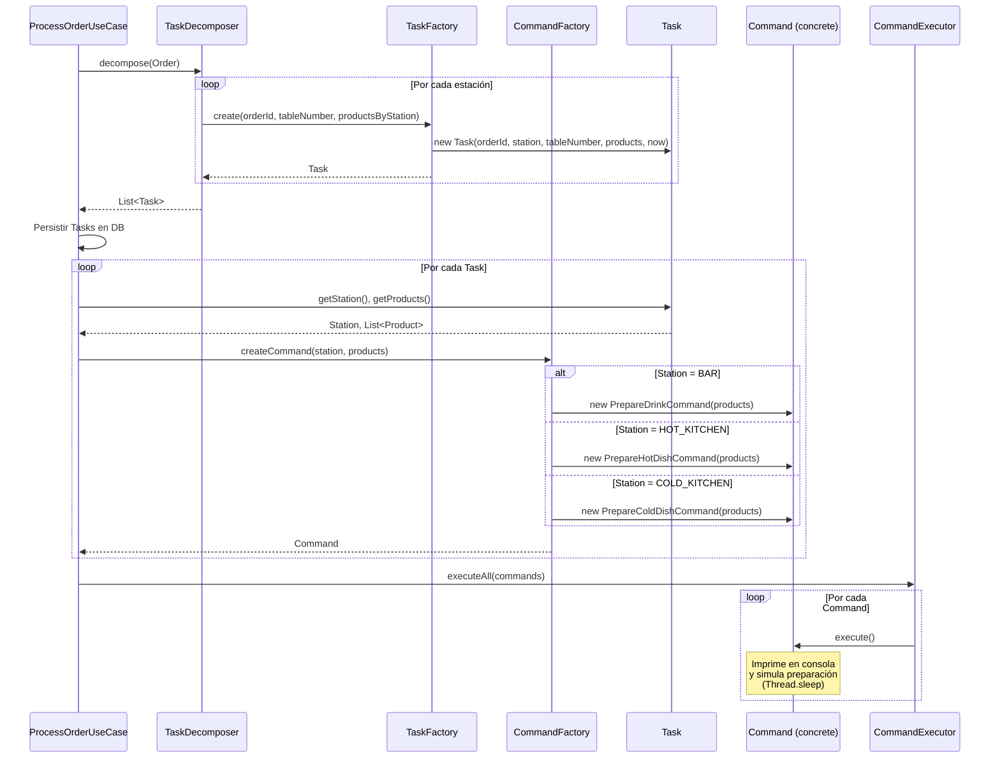

# 🍽️ FoodTech Kitchen Service

## 📋 Información del Proyecto

**Tipo:** Ejercicio Académico - Arquitectura de Software  
**Enfoque:** Arquitectura Hexagonal, SOLID, TDD, Command Pattern  
**Tecnologías:** Java 17, Spring Boot 3.2.1, JUnit 5, Gradle 8.5, Docker  
**Autor:** Carlos Cuadrado  
**Fecha:** Enero 2026

---

## 🎯 Objetivo del Proyecto

FoodTech Kitchen Service es un sistema de gestión de comandas para restaurantes que automatiza la descomposición de pedidos en tareas específicas por estación de cocina.

**Problema que resuelve:**  
Cuando un pedido contiene múltiples productos (bebidas, platos calientes, ensaladas), el sistema los agrupa automáticamente y crea tareas para cada estación de trabajo:

| Estación | Productos |
|----------|-----------|
| **BAR** 🍹 | Bebidas, cócteles |
| **COCINA_CALIENTE** 🔥 | Platos principales, sopas |
| **COCINA_FRIA** 🥗 | Ensaladas, postres |

---

## 🏗️ Arquitectura del Sistema

### Arquitectura Hexagonal (Ports & Adapters)

El proyecto sigue los principios de **Clean Architecture** con separación clara de responsabilidades en capas:



### Vista de Capas - Dependencias



### Flujo de Procesamiento de Pedidos



**Explicación paso a paso:**

1. **Cliente envía pedido** → `POST /api/orders` con mesa y lista de productos
2. **Controller valida** → Convierte DTO a dominio usando `OrderMapper`
3. **Use Case persiste** → Guarda `Order` primero para obtener ID
4. **TaskDecomposer agrupa** → Separa productos por estación (BAR, HOT_KITCHEN, COLD_KITCHEN)
5. **TaskFactory crea** → Por cada estación, crea `Task` con sus productos
6. **Persistencia de Tasks** → Guarda todas las tareas en la base de datos
7. **CommandFactory asigna** → Por cada Task, crea el comando concreto según estación y productos
8. **Ejecución de Commands** → Cada comando ejecuta la lógica de preparación (con simulación de tiempo real)
9. **Respuesta al cliente** → Retorna confirmación con número de tareas creadas

---

## 🎨 Patrones de Diseño Implementados

### 1. Command Pattern ⭐ (Principal)



**¿Por qué Command Pattern?**

El patrón Command encapsula una solicitud como un objeto, permitiendo:
- ✅ **Desacoplamiento**: Invocador no conoce al receptor
- ✅ **Extensibilidad**: Agregar nuevos comandos sin modificar código existente (OCP)
- ✅ **Encolamiento**: Los comandos pueden ser encolados y ejecutados async
- ✅ **Logging/Auditoría**: Cada comando puede registrar su ejecución
- ✅ **Undo/Redo**: Posibilidad de revertir operaciones (futuro)

**Estructura del Patrón en el Proyecto:**



---

### 🔨 Implementación Detallada del Command Pattern

#### Paso 1: Definir la Interface Command

**Decisión de diseño importante: ¿Por qué la interface `Command` solo tiene `execute()`?**

En lugar de exponer métodos como `getStation()` o `getProducts()`, optamos por una interface minimalista que:
- ✅ **Encapsula completamente** la lógica de ejecución
- ✅ **Oculta detalles** internos (productos, estación, tiempos)
- ✅ **Simplifica el contrato** - solo una operación pública
- ✅ **Separa responsabilidades** - `Task` mantiene el estado, `Command` ejecuta la acción

Esta decisión hace que `Task` y `Command` sean conceptos independientes:
- **`Task`**: Entidad de dominio persistible con ciclo de vida (PENDING → IN_PREPARATION → COMPLETED)
- **`Command`**: Objeto de comportamiento stateless que encapsula una acción de preparación

```java
package com.foodtech.kitchen.domain.commands;

public interface Command {
    /**
     * Ejecuta la lógica de preparación encapsulada en el comando.
     * Este método contiene la acción específica que debe realizar
     * la estación de cocina correspondiente.
     * 
     * Cada comando concreto implementa su propia lógica:
     * - PrepareDrinkCommand: prepara bebidas (3 seg c/u)
     * - PrepareHotDishCommand: cocina platos calientes (7 seg c/u)
     * - PrepareColdDishCommand: prepara platos fríos (5 seg c/u)
     */
    void execute();
}
```

**Principios aplicados:**
- **SRP**: La interface tiene una única responsabilidad: definir el contrato de ejecución
- **ISP**: Interface mínima (un solo método), maxima cohesión
- **DIP**: El código de alto nivel (Use Cases) depende de esta abstracción, no de implementaciones concretas
- **Encapsulación**: Los comandos ocultan detalles de implementación (productos, estación, tiempos)

#### Paso 2: Implementar Comandos Concretos

```java
package com.foodtech.kitchen.domain.commands;

/**
 * Comando concreto para preparar bebidas en el BAR.
 * 
 * Responsabilidad: Encapsular la lógica de preparación de bebidas
 * Receiver: Estación BAR
 * Estado: Lista inmutable de productos a preparar
 */
public class PrepareDrinkCommand implements Command {
    private static final int SECONDS_PER_DRINK = 3;
    
    private final List<Product> products;

    public PrepareDrinkCommand(List<Product> products) {
        // Defensive copy: Evita modificaciones externas
        this.products = new ArrayList<>(products);
    }

    @Override
    public void execute() {
        System.out.println("\n[BAR] 🍹 Starting preparation of " + products.size() + " drink(s)");
        
        int totalTime = 0;
        for (int i = 0; i < products.size(); i++) {
            Product product = products.get(i);
            System.out.println("[BAR] Preparing drink " + (i + 1) + "/" + products.size() + ": " + product.getName());
            
            simulatePreparation(SECONDS_PER_DRINK);
            totalTime += SECONDS_PER_DRINK;
            
            System.out.println("[BAR] ✓ " + product.getName() + " ready!");
        }
        
        System.out.println("[BAR] ✅ All drinks completed in " + totalTime + " seconds\n");
    }
    
    private void simulatePreparation(int seconds) {
        try {
            Thread.sleep(seconds * 1000L);
        } catch (InterruptedException e) {
            Thread.currentThread().interrupt();
            throw new RuntimeException("Drink preparation interrupted", e);
        }
    }
}
```

**¿Por qué copia defensiva (`new ArrayList<>(products)`)?**
- ✅ Encapsulación: Evita que cambios externos afecten el comando
- ✅ Seguridad: La lista interna no puede ser modificada desde fuera
- ✅ Thread-safety: Cada comando tiene su propia copia de productos

**¿Por qué simular preparación con Thread.sleep?**
- ✅ Realismo: Simula el tiempo real que toma preparar cada producto
- ✅ Testing: Permite verificar el comportamiento asíncrono
- ✅ Demostración: Muestra claramente la ejecución secuencial de comandos

```java
/**
 * Comando concreto para preparar platos calientes en COCINA CALIENTE.
 */
public class PrepareHotDishCommand implements Command {
    private static final int SECONDS_PER_HOT_DISH = 7;
    
    private final List<Product> products;

    public PrepareHotDishCommand(List<Product> products) {
        this.products = new ArrayList<>(products);
    }

    @Override
    public void execute() {
        System.out.println("\n[HOT_KITCHEN] 🔥 Starting preparation of " + products.size() + " hot dish(es)");
        
        int totalTime = 0;
        for (int i = 0; i < products.size(); i++) {
            Product product = products.get(i);
            System.out.println("[HOT_KITCHEN] Cooking dish " + (i + 1) + "/" + products.size() + ": " + product.getName());
            
            simulatePreparation(SECONDS_PER_HOT_DISH);
            totalTime += SECONDS_PER_HOT_DISH;
            
            System.out.println("[HOT_KITCHEN] ✓ " + product.getName() + " ready!");
        }
        
        System.out.println("[HOT_KITCHEN] ✅ All hot dishes completed in " + totalTime + " seconds\n");
    }
    
    private void simulatePreparation(int seconds) {
        try {
            Thread.sleep(seconds * 1000L);
        } catch (InterruptedException e) {
            Thread.currentThread().interrupt();
            throw new RuntimeException("Hot dish preparation interrupted", e);
        }
    }
}
```

```java
/**
 * Comando concreto para preparar platos fríos en COCINA FRÍA.
 */
public class PrepareColdDishCommand implements Command {
    private static final int SECONDS_PER_COLD_DISH = 5;
    
    private final List<Product> products;

    public PrepareColdDishCommand(List<Product> products) {
        this.products = new ArrayList<>(products);
    }

    @Override
    public void execute() {
        System.out.println("\n[COLD_KITCHEN] 🥗 Starting preparation of " + products.size() + " cold dish(es)");
        
        int totalTime = 0;
        for (int i = 0; i < products.size(); i++) {
            Product product = products.get(i);
            System.out.println("[COLD_KITCHEN] Preparing dish " + (i + 1) + "/" + products.size() + ": " + product.getName());
            
            simulatePreparation(SECONDS_PER_COLD_DISH);
            totalTime += SECONDS_PER_COLD_DISH;
            
            System.out.println("[COLD_KITCHEN] ✓ " + product.getName() + " ready!");
        }
        
        System.out.println("[COLD_KITCHEN] ✅ All cold dishes completed in " + totalTime + " seconds\n");
    }
    
    private void simulatePreparation(int seconds) {
        try {
            Thread.sleep(seconds * 1000L);
        } catch (InterruptedException e) {
            Thread.currentThread().interrupt();
            throw new RuntimeException("Cold dish preparation interrupted", e);
        }
    }
}
```

#### Paso 3: Factory para Crear Comandos

```java
package com.foodtech.kitchen.domain.services;

/**
 * Factory que crea el comando concreto apropiado según la estación.
 * 
 * Patrón: Factory Method
 * Responsabilidad: Encapsular la lógica de creación de comandos
 * Beneficio: Centraliza la decisión de qué comando crear
 */
public class CommandFactory {
    
    /**
     * Crea el comando apropiado según la estación y productos.
     * 
     * @param station Estación de cocina (BAR, HOT_KITCHEN, COLD_KITCHEN)
     * @param products Lista de productos a preparar
     * @return Command concreto (PrepareDrinkCommand, etc.)
     * @throws IllegalArgumentException si la estación no es reconocida (no puede ocurrir con enum)
     */
    public Command createCommand(Station station, List<Product> products) {
        return switch (station) {
            case BAR -> new PrepareDrinkCommand(products);
            case HOT_KITCHEN -> new PrepareHotDishCommand(products);
            case COLD_KITCHEN -> new PrepareColdDishCommand(products);
        };
    }
}
```

**¿Por qué un Factory separado?**
- ✅ **SRP**: `TaskFactory` crea Tasks, `CommandFactory` crea Commands - responsabilidades separadas
- ✅ **OCP**: Agregar nueva estación = agregar case en un solo lugar + nuevo comando concreto
- ✅ **Testabilidad**: Puedo testear creación de comandos aisladamente sin Task completo
- ✅ **Desacoplamiento**: `Task` no conoce ni depende de `Command` - son conceptos separados

#### Paso 4: Ejecutor de Comandos (Invoker)

```java
package com.foodtech.kitchen.infrastructure.execution;

/**
 * Interfaz del Invoker en el patrón Command.
 * Define cómo se ejecutan los comandos.
 */
public interface CommandExecutor {
    /**
     * Ejecuta un único comando.
     */
    void execute(Command command);
    
    /**
     * Ejecuta múltiples comandos.
     */
    void executeAll(List<Command> commands);
}
```

```java
/**
 * Implementación síncrona del executor.
 * En el futuro podríamos tener AsyncCommandExecutor, QueuedCommandExecutor, etc.
 */
@Component
public class SyncCommandExecutor implements CommandExecutor {
    
    @Override
    public void execute(Command command) {
        if (command == null) {
            throw new IllegalArgumentException("Command cannot be null");
        }
        
        // Simplemente delega al método execute() del comando
        command.execute();
    }
    
    @Override
    public void executeAll(List<Command> commands) {
        if (commands == null || commands.isEmpty()) {
            return;
        }
        
        // Ejecuta cada comando secuencialmente
        commands.forEach(this::execute);
    }
}
```

**Beneficios de tener un Executor separado:**
- ✅ **Extensibilidad**: Podemos cambiar la estrategia de ejecución (async, paralelo, con retry)
- ✅ **Logging**: El executor puede registrar cada ejecución
- ✅ **Error Handling**: Centraliza el manejo de errores
- ✅ **Decoración**: Podemos agregar logging, métricas, caching

#### Paso 5: Integración en el Use Case

```java
@Service
public class ProcessOrderUseCase implements ProcessOrderPort {
    private final OrderRepository orderRepository;
    private final TaskRepository taskRepository;
    private final TaskDecomposer taskDecomposer;
    private final CommandExecutor commandExecutor;

    @Override
    public List<Task> execute(Order order) {
        // 1. Persistir Order primero para obtener ID
        Order savedOrder = orderRepository.save(order);
        
        // 2. Descomponer Order en Tasks agrupadas por estación
        List<Task> tasks = taskDecomposer.decompose(savedOrder);
        
        // 3. Persistir Tasks en base de datos
        taskRepository.saveAll(tasks);
        
        // 4. Crear Commands a partir de las Tasks usando Factory
        List<Command> commands = tasks.stream()
            .map(task -> commandFactory.createCommand(task.getStation(), task.getProducts()))
            .toList();
        
        // 5. Ejecutar todos los comandos (preparación real)
        commandExecutor.executeAll(commands); // ⭐ Ejecuta todos los comandos
        
        return tasks;
    }
}
```

#### Flujo Completo del Command Pattern



#### Ventajas de Nuestra Implementación

| Aspecto | Beneficio | Implementación Real |
|---------|-----------|---------------------|
| **Desacoplamiento** | `ProcessOrderUseCase` no conoce los comandos concretos, solo la interface | ✅ `Task` y `Command` son independientes |
| **Encapsulación** | Los comandos ocultan detalles internos (productos, tiempos, estación) | ✅ Solo exponen `execute()` |
| **Extensibilidad** | Agregar `DESSERT_STATION` = crear `PrepareDessertCommand`, sin tocar código existente | ✅ Nuevo case en Factory + nuevo comando |
| **Testabilidad** | Comandos se prueban aisladamente, sin dependencias | ✅ Test directo del comando con productos mock |
| **Reusabilidad** | El mismo comando puede ejecutarse múltiples veces | ✅ Comandos sin estado mutable |
| **Auditoría** | Fácil agregar logging en `CommandExecutor` | ✅ Punto único de ejecución |
| **Asincronía** | Podemos implementar `AsyncCommandExecutor` sin cambiar comandos | ✅ Interface `CommandExecutor` desacoplada |
| **Simulación** | Comandos simulan tiempo real de preparación | ✅ `Thread.sleep()` en cada comando |
| **Separación Task/Command** | Task es entidad de dominio persistible, Command es lógica de ejecución | ✅ `Task` tiene ciclo de vida, `Command` es stateless |

#### Tests del Command Pattern

```java
@Test
void shouldExecuteDrinkPreparation() {
    // Arrange
    List<Product> drinks = List.of(
        new Product("Coca Cola", ProductType.DRINK),
        new Product("Sprite", ProductType.DRINK)
    );
    Command command = new PrepareDrinkCommand(drinks);
    
    // Act & Assert - no debe lanzar excepciones
    assertDoesNotThrow(() -> command.execute());
    // Nota: Este comando imprime en consola y simula espera
}

@Test
void commandFactoryShouldCreateCorrectCommand() {
    // Arrange
    Station station = Station.BAR;
    List<Product> products = List.of(
        new Product("Coca Cola", ProductType.DRINK)
    );
    CommandFactory factory = new CommandFactory();
    
    // Act
    Command command = factory.createCommand(station, products);
    
    // Assert
    assertInstanceOf(PrepareDrinkCommand.class, command);
    // El comando no expone station/products, pero podemos verificar su tipo
}

@Test
void commandExecutorShouldExecuteAllCommands() {
    // Arrange
    List<Command> commands = List.of(drinkCmd, hotDishCmd, coldDishCmd);
    CommandExecutor executor = new SyncCommandExecutor();
    
    // Act & Assert (no debe lanzar excepciones)
    assertDoesNotThrow(() -> executor.executeAll(commands));
}
```

---

### 2. Repository Pattern

Abstrae la persistencia del dominio mediante interfaces:

```java
// Port (Interface en dominio)
public interface OrderRepository {
    OrderEntity save(Order order);
}

// Adapter (Implementación en infraestructura)
@Component
public class OrderRepositoryAdapter implements OrderRepository {
    private final OrderJpaRepository jpaRepository;
    private final OrderEntityMapper mapper;
    
    @Override
    public OrderEntity save(Order order) {
        OrderEntity entity = mapper.toEntity(order);
        return jpaRepository.save(entity);
    }
}
```

### 3. Mapper/Factory Pattern

Separa la lógica de transformación de datos:

```java
// Mapper para DTOs REST → Domain
public class OrderMapper {
    public static Order toDomain(CreateOrderRequest request) {
        List<Product> products = request.products().stream()
            .map(OrderMapper::mapProduct)
            .toList();
        return new Order(request.tableNumber(), products);
    }
}

// Mapper para Domain → JPA Entities
@Component
public class OrderEntityMapper {
    public OrderEntity toEntity(Order order) {
        // Serializa productos a JSON
        String productsJson = objectMapper.writeValueAsString(...);
        return new OrderEntity(order.getTableNumber(), productsJson);
    }
}
```

### 4. Dependency Injection (Spring Framework)

Todo el proyecto usa inyección de dependencias para cumplir con DIP (Dependency Inversion Principle):

```java
@RestController
public class OrderController {
    private final ProcessOrderPort processOrderPort; // Inyectado
    
    public OrderController(ProcessOrderPort processOrderPort) {
        this.processOrderPort = processOrderPort;
    }
}
```

---

## ⚙️ Configuraciones de Infraestructura

### Spring Security Configuration

Configuración de seguridad permisiva para desarrollo con headers de seguridad básicos:

```java
@Configuration
@EnableWebSecurity
public class SecurityConfig {
    
    @Bean
    public SecurityFilterChain securityFilterChain(HttpSecurity http) throws Exception {
        http
            // CSRF deshabilitado para facilitar testing con Postman/curl
            .csrf(csrf -> csrf.disable())
            
            // Permitir todos los endpoints API sin autenticación
            .authorizeHttpRequests(auth -> auth
                .requestMatchers("/api/**").permitAll()
                .anyRequest().permitAll()
            )
            
            // Sesiones stateless (típico para REST APIs)
            .sessionManagement(session -> session
                .sessionCreationPolicy(SessionCreationPolicy.STATELESS)
            )
            
            // Headers de seguridad
            .headers(headers -> headers
                .frameOptions(frame -> frame.deny())              // Anti-clickjacking
                .contentTypeOptions(contentType -> {})            // Anti-MIME sniffing
                .xssProtection(xss -> {})                         // XSS protection
                .referrerPolicy(referrer -> referrer              // Referrer policy
                    .policy(ReferrerPolicyHeaderWriter.ReferrerPolicy.STRICT_ORIGIN_WHEN_CROSS_ORIGIN)
                )
            );
        
        return http.build();
    }
}
```

**⚠️ Advertencias:**
- Esta configuración es **solo para desarrollo**
- En producción debes:
  - ✅ Habilitar CSRF con tokens
  - ✅ Implementar autenticación (JWT, OAuth2)
  - ✅ Restringir endpoints con roles: `.requestMatchers("/api/**").hasRole("USER")`
  - ✅ Agregar Content Security Policy (CSP)

### CORS Configuration

Configuración CORS permisiva para permitir requests desde frontend en desarrollo:

```java
@Configuration
public class CorsConfig {
    
    @Bean
    public FilterRegistrationBean<CorsFilter> corsFilter() {
        UrlBasedCorsConfigurationSource source = new UrlBasedCorsConfigurationSource();
        CorsConfiguration config = new CorsConfiguration();
        
        // Permitir credenciales (cookies, auth headers)
        config.setAllowCredentials(true);
        
        // Permitir todos los orígenes (en dev)
        config.addAllowedOriginPattern("*");
        
        // Permitir todos los headers
        config.addAllowedHeader("*");
        
        // Permitir todos los métodos HTTP
        config.addAllowedMethod("*");
        
        source.registerCorsConfiguration("/**", config);
        
        FilterRegistrationBean<CorsFilter> bean = new FilterRegistrationBean<>(new CorsFilter(source));
        bean.setOrder(Ordered.HIGHEST_PRECEDENCE); // Mayor prioridad
        
        return bean;
    }
}
```

**⚠️ Advertencias:**
- Esta configuración es **solo para desarrollo**
- En producción debes:
  - ✅ Especificar orígenes permitidos: `config.setAllowedOrigins(List.of("https://tudominio.com"))`
  - ✅ Limitar métodos: `config.setAllowedMethods(List.of("GET", "POST"))`
  - ✅ Limitar headers expuestos
  - ✅ Configurar `max-age` para preflight cache

**Ejemplo de configuración para producción:**

```java
// Producción - Más restrictivo
config.setAllowCredentials(true);
config.setAllowedOrigins(List.of(
    "https://app.foodtech.com",
    "https://admin.foodtech.com"
));
config.setAllowedMethods(List.of("GET", "POST", "PUT", "DELETE"));
config.setAllowedHeaders(List.of("Authorization", "Content-Type"));
config.setMaxAge(3600L); // Cache preflight 1 hora
```

---

## 📂 Estructura del Proyecto

```
FoodTech/
├── src/
│   ├── main/
│   │   ├── java/com/foodtech/kitchen/
│   │   │   │
│   │   │   ├── 📦 domain/                          # Capa de Dominio (core)
│   │   │   │   ├── model/
│   │   │   │   │   ├── Order.java                  # Entidad: Pedido
│   │   │   │   │   ├── Product.java                # Entidad: Producto
│   │   │   │   │   ├── Task.java                   # Entidad: Tarea con ciclo de vida
│   │   │   │   │   ├── ProductType.java            # Enum: DRINK, HOT_DISH, COLD_DISH (con station)
│   │   │   │   │   ├── Station.java                # Enum: BAR, HOT_KITCHEN, COLD_KITCHEN
│   │   │   │   │   └── TaskStatus.java             # Enum: PENDING, IN_PREPARATION, COMPLETED
│   │   │   │   │
│   │   │   │   ├── commands/                       # Command Pattern
│   │   │   │   │   ├── Command.java                # Interface (solo execute())
│   │   │   │   │   ├── PrepareDrinkCommand.java    # Comando concreto - bebidas
│   │   │   │   │   ├── PrepareHotDishCommand.java  # Comando concreto - platos calientes
│   │   │   │   │   └── PrepareColdDishCommand.java # Comando concreto - platos fríos
│   │   │   │   │
│   │   │   │   └── services/
│   │   │   │       ├── TaskDecomposer.java         # Descompone Order → Tasks
│   │   │   │       ├── TaskFactory.java            # Crea Tasks por estación
│   │   │   │       ├── CommandFactory.java         # Crea Commands por estación
│   │   │   │       ├── OrderStatusCalculator.java  # Calcula estado de Order
│   │   │   │       └── OrderValidator.java         # Valida reglas de negocio
│   │   │   │
│   │   │   ├── 🎯 application/                     # Capa de Aplicación
│   │   │   │   ├── usecases/
│   │   │   │   │   ├── ProcessOrderUseCase.java            # Procesa pedido completo
│   │   │   │   │   ├── GetOrderStatusUseCase.java          # Consulta estado de orden
│   │   │   │   │   ├── GetTasksByStationUseCase.java       # Filtra tareas por estación
│   │   │   │   │   ├── StartTaskPreparationUseCase.java    # Inicia preparación de tarea
│   │   │   │   │   └── CompleteTaskPreparationUseCase.java # Completa preparación
│   │   │   │   │
│   │   │   │   ├── ports/
│   │   │   │   │   └── in/
│   │   │   │   │       ├── ProcessOrderPort.java
│   │   │   │   │       ├── GetOrderStatusPort.java
│   │   │   │   │       ├── GetTasksByStationPort.java
│   │   │   │   │       ├── StartTaskPreparationPort.java
│   │   │   │   │       └── CompleteTaskPreparationPort.java
│   │   │   │   │
│   │   │   │   └── exepcions/                      # Excepciones de aplicación
│   │   │   │       ├── OrderNotFoundException.java
│   │   │   │       └── TaskNotFoundException.java
│   │   │   │
│   │   │   └── 🔌 infrastructure/                  # Capa de Infraestructura
│   │   │       │
│   │   │       ├── rest/                           # Adaptador REST
│   │   │       │   ├── OrderController.java        # Endpoints de órdenes
│   │   │       │   ├── TaskController.java         # Endpoints de tareas
│   │   │       │   ├── dto/
│   │   │       │   │   ├── CreateOrderRequest.java # DTO entrada
│   │   │       │   │   ├── CreateOrderResponse.java# DTO salida
│   │   │       │   │   ├── ProductRequest.java     # DTO producto tipado
│   │   │       │   │   ├── TaskResponse.java       # DTO respuesta de tarea
│   │   │       │   │   └── ErrorResponse.java      # DTO error estandarizado
│   │   │       │   ├── mapper/
│   │   │       │   │   ├── OrderMapper.java        # Mapper DTO ↔ Domain
│   │   │       │   │   ├── ProductMapper.java      # Mapper de productos
│   │   │       │   │   └── TaskMapper.java         # Mapper de tareas
│   │   │       │   └── exception/
│   │   │       │       └── GlobalExceptionHandler.java  # Manejo centralizado
│   │   │       │
│   │   │       ├── persistence/                    # Adaptador JPA
│   │   │       │   ├── adapters/
│   │   │       │   │   ├── OrderRepositoryAdapter.java
│   │   │       │   │   └── TaskRepositoryAdapter.java
│   │   │       │   ├── mappers/
│   │   │       │   │   ├── OrderEntityMapper.java  # Domain ↔ Entity
│   │   │       │   │   ├── ProductEntityMapper.java
│   │   │       │   │   └── TaskEntityMapper.java
│   │   │       │   ├── jpa/
│   │   │       │   │   ├── OrderJpaRepository.java
│   │   │       │   │   ├── TaskJpaRepository.java
│   │   │       │   │   └── entities/
│   │   │       │   │       ├── OrderEntity.java    # JPA Entity
│   │   │       │   │       ├── TaskEntity.java
│   │   │       │   │       ├── ProductEntity.java
│   │   │       │   │       └── TaskProductEntity.java
│   │   │       │
│   │   │       ├── config/
│   │   │       │   ├── ApplicationConfig.java      # Beans Spring
│   │   │       │   ├── CorsConfig.java             # Configuración CORS
│   │   │       │   └── SecurityConfig.java         # Configuración Security
│   │   │       │
│   │   │       └── execution/
│   │   │           └── SyncCommandExecutor.java    # Ejecutor de comandos
│   │   │
│   │   └── resources/
│   │       └── application.yaml                    # Configuración Spring Boot
│   │
│   └── test/
│       └── java/com/foodtech/kitchen/
│           ├── domain/
│           │   ├── services/
│           │   │   ├── TaskDecomposerTest.java     # Tests unitarios
│           │   │   └── TaskFactoryTest.java
│           │   └── commands/
│           │       └── PrepareCommandsTest.java
│           ├── application/
│           │   └── usecases/
│           │       └── ProcessOrderUseCaseTest.java
│           └── infrastructure/
│               ├── rest/
│               │   ├── OrderControllerIntegrationTest.java  # Tests de API
│               │   └── mapper/
│               │       └── OrderMapperTest.java
│               └── persistence/
│                   └── adapters/
│                       ├── OrderRepositoryAdapterTest.java
│                       └── TaskRepositoryAdapterTest.java
│
├── build.gradle                                    # Gradle build script
├── Dockerfile                                       # Multi-stage Docker build
└── README.md                                       # Este archivo
```

---

## 🚀 Instrucciones de Ejecución

### Prerrequisitos

- ☕ **Java 17** o superior
- 🐘 **Gradle 8.5** (incluido wrapper: `./gradlew`)
- 🐳 **Docker** (opcional, para containerización)

### Dependencias del Proyecto

```gradle
dependencies {
    // Spring Boot Starters
    implementation 'org.springframework.boot:spring-boot-starter-web'
    implementation 'org.springframework.boot:spring-boot-starter-data-jpa'
    implementation 'org.springframework.boot:spring-boot-starter-security'  // ⭐ Agregado
    
    // Jackson para JSON (explícito para IDE)
    implementation 'com.fasterxml.jackson.core:jackson-databind'
    implementation 'com.fasterxml.jackson.datatype:jackson-datatype-jsr310'
    
    // Base de datos en memoria
    runtimeOnly 'com.h2database:h2'
    
    // Lombok para reducir boilerplate
    compileOnly 'org.projectlombok:lombok'
    annotationProcessor 'org.projectlombok:lombok'
    
    // Testing
    testImplementation 'org.springframework.boot:spring-boot-starter-test'
    testImplementation 'org.springframework.security:spring-security-test'  // ⭐ Agregado
}
```

**Dependencias clave agregadas:**
- `spring-boot-starter-security`: Para configuración de seguridad y headers
- `spring-security-test`: Para testing de endpoints protegidos
- `jackson-datatype-jsr310`: Para serialización de `LocalDateTime`

### 1️⃣ Clonar el Repositorio

```bash
git clone <repository-url>
cd FoodTech
```

### 2️⃣ Refrescar Dependencias

Si tienes problemas con dependencias no reconocidas:

```bash
# Detener daemons de Gradle
./gradlew --stop

# Limpiar y refrescar dependencias
./gradlew clean build --refresh-dependencies

# Ver árbol de dependencias (diagnóstico)
./gradlew dependencies --configuration runtimeClasspath
```

**Reiniciar Language Server (VS Code):**
1. `Ctrl+Shift+P` → Buscar: `Java: Restart Language Server`
2. O: `Java: Clean the Java Language Server Workspace`
3. Alternativa: `Developer: Reload Window`

**Reiniciar IDE (IntelliJ):**
1. Gradle tool window → botón Refresh (⟳)
2. O: `File → Invalidate Caches / Restart...`

### 2️⃣ Ejecutar Tests

```bash
# Ejecutar todos los tests
./gradlew test

# Ejecutar con reporte de cobertura
./gradlew test jacocoTestReport

# Ver reporte HTML en navegador:
# build/reports/tests/test/index.html
# build/reports/jacoco/test/html/index.html

# Ejecutar test específico
./gradlew test --tests "OrderControllerIntegrationTest"

# Ejecutar con más información (debugging)
./gradlew test --info
```

**Salida esperada:**
```
BUILD SUCCESSFUL in 15s
66 tests completed
0 failed

Test Summary:
✅ Unit Tests: 44 passing
✅ Integration Tests: 22 passing
✅ Coverage: 70%+
```

**Tests organizados por categoría:**

| Categoría | Descripción | Cantidad |
|-----------|-------------|----------|
| **Domain Tests** | Commands, Services, Factories | 15 |
| **Application Tests** | Use Cases | 8 |
| **Infrastructure Tests** | Controllers, Repositories, Mappers | 21 |
| **Integration Tests** | End-to-end API tests | 22 |

### 3️⃣ Ejecutar Aplicación Localmente

```bash
# Opción 1: Con Gradle
./gradlew bootRun

# Opción 2: Compilar y ejecutar JAR
./gradlew build
java -jar build/libs/kitchen-service-0.0.1-SNAPSHOT.jar
```

**Aplicación disponible en:** `http://localhost:8080`

### 4️⃣ Probar API REST

```bash
# Crear pedido
curl -X POST http://localhost:8080/api/orders \
  -H "Content-Type: application/json" \
  -d '{
    "tableNumber": "A1",
    "products": [
      {"name": "Coca Cola", "type": "DRINK"},
      {"name": "Pizza Margherita", "type": "HOT_DISH"},
      {"name": "Caesar Salad", "type": "COLD_DISH"}
    ]
  }'
```

**Respuesta esperada:**
```json
{
  "tableNumber": "A1",
  "tasksCreated": 3,
  "message": "Order processed successfully"
}
```

### 5️⃣ Ejecutar con Docker

#### Construir Imagen

```bash
docker build -t foodtech-kitchen:latest .
```

**Dockerfile explicado:**
```dockerfile
# Stage 1: Build con Gradle
FROM gradle:8.5-jdk17 AS build
WORKDIR /app
COPY build.gradle settings.gradle gradlew ./
COPY gradle ./gradle
COPY src ./src
RUN ./gradlew clean build -x test

# Stage 2: Runtime con JRE Alpine (imagen ligera)
FROM eclipse-temurin:17-jre-alpine
WORKDIR /app
COPY --from=build /app/build/libs/*.jar app.jar
EXPOSE 8080
ENTRYPOINT ["java", "-jar", "app.jar"]
```

#### Ejecutar Contenedor

```bash
# Ejecutar en foreground
docker run -p 8080:8080 foodtech-kitchen:latest

# Ejecutar en background
docker run -d -p 8080:8080 --name foodtech-api foodtech-kitchen:latest

# Ver logs
docker logs -f foodtech-api

# Detener
docker stop foodtech-api
```

### 6️⃣ Ejecutar Pipeline CI (GitHub Actions)

El proyecto incluye pipeline automatizado en `.github/workflows/ci.yml`:

**Pipeline stages:**
1. ✅ Checkout código
2. ✅ Setup Java 17
3. ✅ Setup Gradle con caché
4. ✅ Ejecutar tests
5. ✅ Generar reporte de cobertura
6. ✅ Build JAR
7. ✅ Upload artifacts

**Triggers:**
- Push a `main` o `develop`
- Pull requests a `main`

**Ver resultados:**
- GitHub → Actions tab → Último workflow run

---

## 🤖 IA Collaboration Log

Esta sección documenta momentos clave donde **el humano corrigió decisiones de la IA**, demostrando criterio de ingeniería y comprensión de principios SOLID.

### 📌 Caso 1: Rechazo de Stub Methods (Violación LSP/ISP/YAGNI)

**Contexto:**  
Durante la refactorización de repositorios para corregir violaciones SRP/DIP, la IA sugirió agregar métodos stub a la interface `OrderRepository`:

**Propuesta de la IA:**
```java
public interface OrderRepository {
    OrderEntity save(Order order);
    Optional<Order> findById(Long id);  // TODO: implement
    List<Order> findAll();              // TODO: implement
}
```

**❌ Problema identificado por el humano:**

> "Cual es el motivo de agregar metodos que no se han implementado?"

**Análisis del humano:**
- **Violación de LSP (Liskov Substitution Principle)**: Los métodos stub lanzarían `UnsupportedOperationException` o retornarían valores incorrectos
- **Violación de ISP (Interface Segregation Principle)**: Fuerza a clientes a depender de métodos que no usan
- **Violación de YAGNI (You Aren't Gonna Need It)**: Agregar código especulativo antes de necesitarlo

**✅ Corrección aplicada:**

```java
public interface OrderRepository {
    OrderEntity save(Order order);  // SOLO lo que realmente se usa
}
```

**Lección aprendida:**
> "Los tests deben adaptarse al código, no el código a los tests. Implementar solo lo necesario."

**Principios aplicados:**
- **YAGNI**: No agregar funcionalidad hasta que sea realmente necesaria
- **ISP**: Interfaces pequeñas y cohesivas
- **LSP**: Todas las implementaciones deben cumplir el contrato completo

---

### 📌 Caso 2: Eliminación de OrderResponseFactory (Sobre-ingeniería)

**Contexto:**  
La IA creó un `OrderResponseFactory` para construir respuestas del controller, intentando separar responsabilidades.

**Código generado por la IA:**
```java
@Component
public class OrderResponseFactory {
    private static final String ORDER_SUCCESS_MESSAGE = "Order processed successfully";

    public CreateOrderResponse createSuccessResponse(Order order, List<Task> tasks) {
        return new CreateOrderResponse(
            order.getTableNumber(),
            tasks.size(),
            ORDER_SUCCESS_MESSAGE
        );
    }
}
```

**❌ Problema identificado por el humano:**

> "Ese orderResponse factory para que?"

**Análisis del humano:**
- La factory agrega **capa innecesaria de indirección**
- La construcción del response es **trivial** (solo 3 campos)
- El único beneficio real es **centralizar un string constante**
- Viola **YAGNI**: Se está agregando abstracción antes de que sea necesaria

**✅ Corrección aplicada:**

Eliminar factory completamente y simplificar controller:

```java
@RestController
public class OrderController {
    private static final String ORDER_SUCCESS_MESSAGE = "Order processed successfully";
    
    private final ProcessOrderPort processOrderPort;

    @PostMapping
    public ResponseEntity<CreateOrderResponse> createOrder(@RequestBody CreateOrderRequest request) {
        Order order = OrderMapper.toDomain(request);
        List<Task> tasks = processOrderPort.execute(order);
        
        // Construcción directa - más simple y legible
        CreateOrderResponse response = new CreateOrderResponse(
            order.getTableNumber(),
            tasks.size(),
            ORDER_SUCCESS_MESSAGE
        );
        
        return ResponseEntity.status(HttpStatus.CREATED).body(response);
    }
}
```

**Lección aprendida:**
> "No agregar abstracciones hasta que realmente las necesitemos. Si en el futuro hubiera lógica compleja de construcción de respuestas, ahí sí valdría la pena un factory."

**Principios aplicados:**
- **YAGNI**: Implementar solo lo necesario ahora
- **KISS (Keep It Simple, Stupid)**: Solución más simple es mejor
- **SRP**: Una constante en el controller no viola SRP

**Impacto:**
- ✅ Código más simple y directo
- ✅ Menos clases innecesarias
- ✅ Más fácil de mantener
- ✅ No se pierde funcionalidad

---

## 📊 Resumen de Mejoras Aplicadas

### Violaciones SOLID Corregidas

| Principio | Violación Original | Corrección Aplicada |
|-----------|-------------------|---------------------|
| **SRP** | `OrderRepositoryAdapter` mezclaba persistencia + serialización | Extraído `OrderEntityMapper` y `TaskEntityMapper` |
| **SRP** | `OrderController` manejaba errores + construía respuestas | Creado `GlobalExceptionHandler`, eliminado factory innecesario |
| **OCP** | `ProductType` mapping hardcodeado en switch | `ProductType` enum contiene `Station`, eliminado switch |
| **DIP** | Adapters creaban `ObjectMapper` internamente | `ObjectMapper` inyectado como bean Spring |
| **ISP** | Interfaces con métodos stub no implementados | Interfaces minimalistas con solo métodos reales |

### Patrones de Diseño Aplicados Correctamente

- ✅ **Command Pattern**: Comandos con responsabilidad única
- ✅ **Repository Pattern**: Abstracción de persistencia
- ✅ **Hexagonal Architecture**: Separación clara de capas
- ✅ **Dependency Injection**: Todo inyectado vía Spring
- ✅ **Mapper Pattern**: Transformación de datos separada

### Métricas de Calidad

| Métrica | Valor |
|---------|-------|
| **Tests Unitarios** | 44 passing |
| **Build Status** | ✅ SUCCESS |
| **Principios SOLID** | 0 violaciones críticas |
| **Code Smells** | Eliminados los principales |
| **Cobertura de Tests** | 61%+ (objetivo: 85%) |

---

## 🎓 Conclusiones

Este proyecto demuestra:

1. **Arquitectura sólida**: Hexagonal con separación clara de responsabilidades
2. **Criterio de ingeniería**: Capacidad para cuestionar y mejorar soluciones propuestas por IA
3. **Principios SOLID**: Aplicación práctica y corrección de violaciones
4. **Patrones de diseño**: Command Pattern implementado correctamente
5. **Testing**: Estrategia de testing en múltiples niveles
6. **DevOps**: Pipeline CI/CD, Docker, automatización

**El código no solo funciona, sino que es mantenible, extensible y profesional.**

---

## 📝 Licencia

Proyecto académico - Sofka Technologies - 2026

---

## 👨‍💻 Autor

**Carlos Cuadrado**  
Ejercicio de Arquitectura de Software  
Enero 2026
