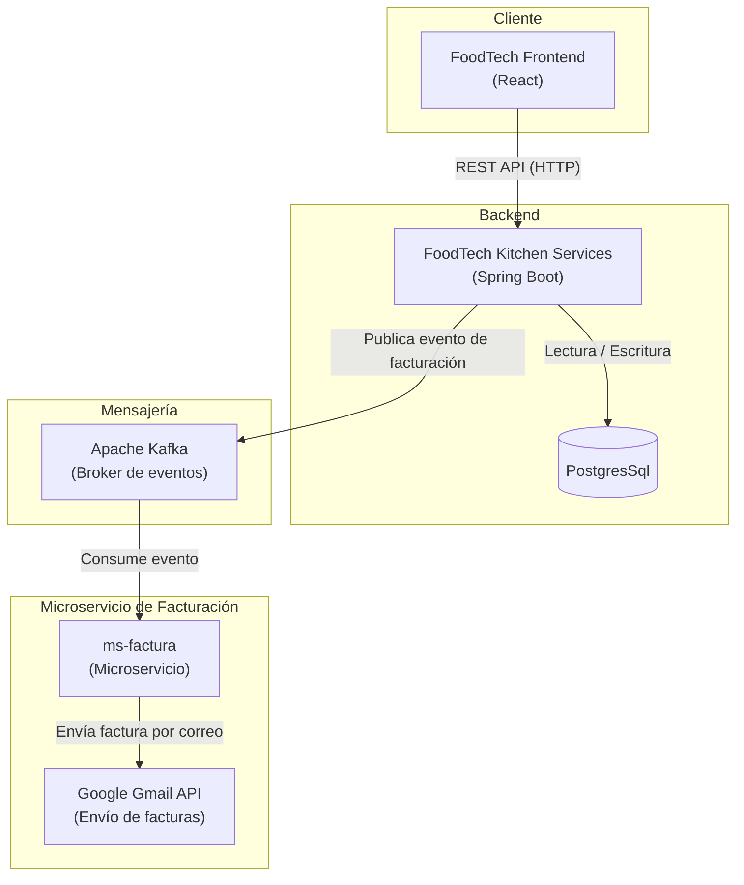

# FoodTech Kitchen Services

## Descripción

Backend del sistema de gestión de restaurantes **FoodTech**. Este servicio se encarga de toda la lógica del lado del servidor: recibir pedidos del mesero, descomponerlos en tareas por estación de cocina (bar, cocina caliente, cocina fría), dar seguimiento al estado de preparación, gestionar el catálogo de productos del menú y soportar la carga masiva de productos mediante archivos CSV.

## Funcionalidades principales

| Funcionalidad | Descripción |
|---|---|
| **Gestión de pedidos** | Recibe un pedido con mesa y productos, lo persiste y lo descompone automáticamente en tareas por estación |
| **Tareas de cocina** | Cada estación (Bar, Cocina Caliente, Cocina Fría) recibe solo las tareas que le corresponden según el tipo de producto |
| **Seguimiento de estado** | Permite consultar el estado de cada tarea (Pendiente, En Preparación, Completada) y el estado global del pedido |
| **Catálogo de productos** | CRUD completo para administrar los productos del menú: crear, listar activos, editar, desactivar y buscar por nombre |
| **Carga masiva CSV** | Permite subir productos en lote mediante un flujo de sesión (iniciar → subir fragmentos → completar), con validación de formato y reporte de errores |
| **Autenticación** | Registro e inicio de sesión de usuarios |
| **Facturación** | Generación de facturas para pedidos completados |

## Arquitectura

El proyecto sigue una **arquitectura hexagonal** (puertos y adaptadores) con tres capas bien definidas:

| Capa | Responsabilidad |
|---|---|
| **Dominio** | Entidades de negocio, reglas de validación y servicios de dominio |
| **Aplicación** | Casos de uso que orquestan las operaciones del negocio |
| **Infraestructura** | Controladores REST, persistencia JPA, configuración de seguridad y CORS |

Patrones de diseño aplicados: Command, Repository, Factory, Mapper y Dependency Injection.

### Diagrama de arquitectura del sistema


```mermaid
graph TB
    subgraph Cliente
        FRONT["FoodTech Frontend<br/>(React)"]
    end

    subgraph Backend
        KS["FoodTech Kitchen Services<br/>(Spring Boot)"]
        DB[(PostgresSql)]
    end

    subgraph Mensajería
        KAFKA["Apache Kafka<br/>(Broker de eventos)"]
    end

    subgraph Microservicio de Facturación
        MSF["ms-factura<br/>(Microservicio)"]
        GMAIL["Google Gmail API<br/>(Envío de facturas)"]
    end

    FRONT -- "REST API (HTTP)" --> KS
    KS -- "Lectura / Escritura" --> DB
    KS -- "Publica evento de facturación" --> KAFKA
    KAFKA -- "Consume evento" --> MSF
    MSF -- "Envía factura por correo" --> GMAIL
```

**Flujo de facturación:** cuando un pedido se completa, Kitchen Services publica un evento en Kafka. El microservicio **ms-factura** consume ese evento, genera la factura y la envía al cliente por correo electrónico a través de la API de Gmail.

## Requisitos previos

- Java 17 o superior
- Gradle 8.5 (incluido vía wrapper `./gradlew`)
- Docker (opcional, para ejecución en contenedor)

## Comandos disponibles

```bash
./gradlew bootRun                                    # Iniciar la aplicación (http://localhost:8080)
./gradlew test                                       # Ejecutar todos los tests
./gradlew test jacocoTestReport                      # Tests + reporte de cobertura
./gradlew test --tests "NombreDelTest"               # Ejecutar un test específico
./gradlew build                                      # Compilar y generar JAR
docker build -t foodtech-kitchen .                   # Construir imagen Docker
docker run -p 8080:8080 foodtech-kitchen             # Ejecutar contenedor
```

## Endpoints principales del catálogo

| Método | Endpoint | Parámetros opcionales | Descripción |
|---|---|---|---|
| GET | `/api/products` | `category`, `name` | Listar productos activos. Acepta filtro por categoría o búsqueda parcial por nombre (case-insensitive) |
| POST | `/api/products` | — | Crear un producto nuevo |
| PUT | `/api/products/{uuid}` | — | Actualizar un producto existente |
| PATCH | `/api/products/{uuid}/deactivate` | — | Desactivar un producto |
| PATCH | `/api/products/{uuid}/activate` | — | Activar un producto |

## Contrato de API

La colección Postman con todos los endpoints disponibles se encuentra en [FoodTech_v2.json](FoodTech_v2.json).

---

Proyecto académico — Sofka Technologies — 2026
